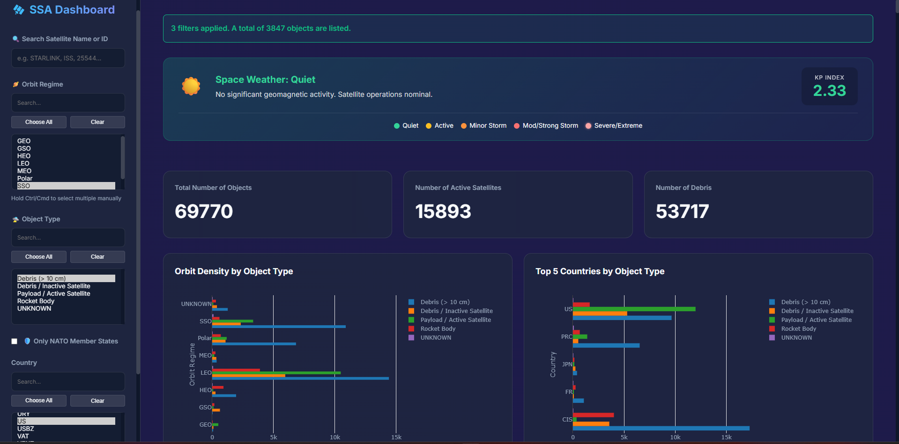
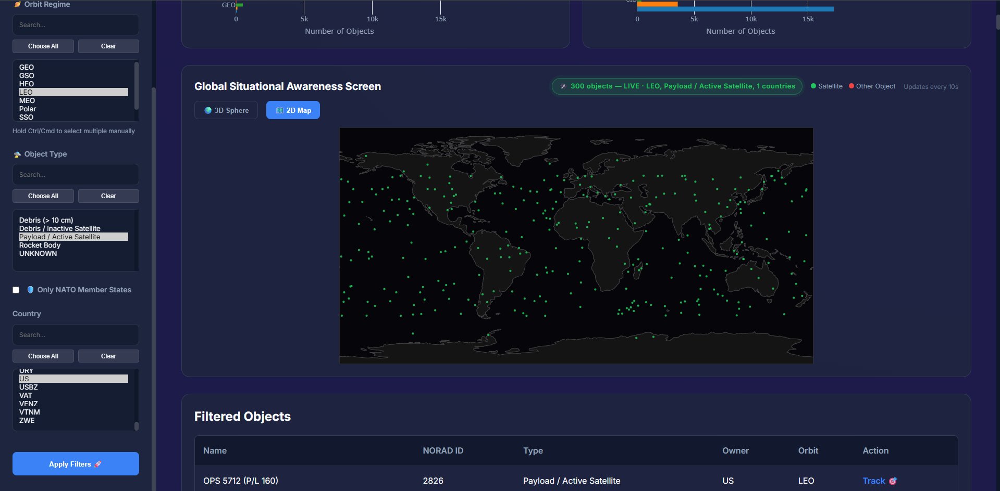
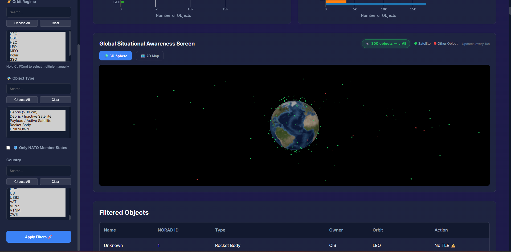
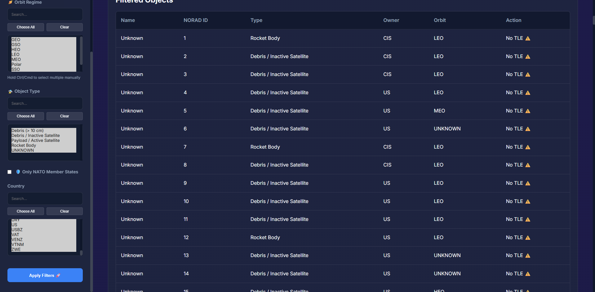
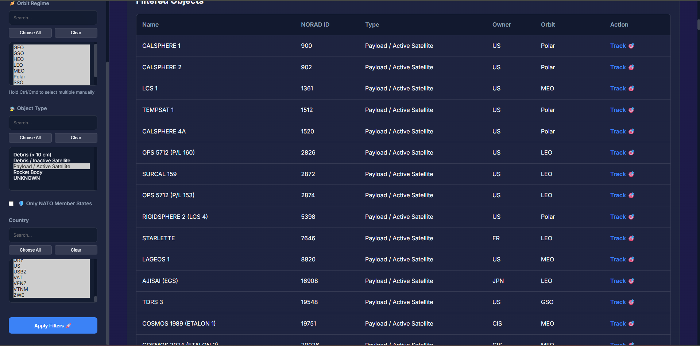
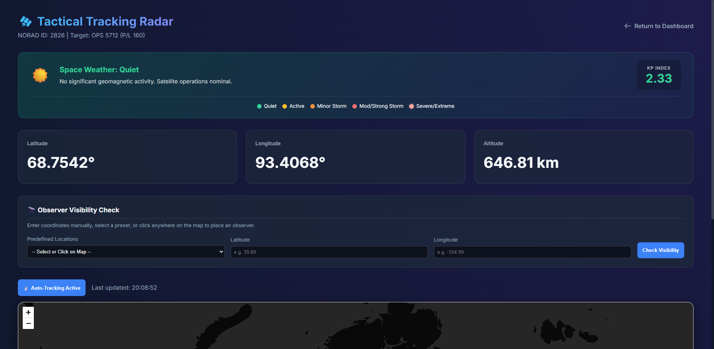
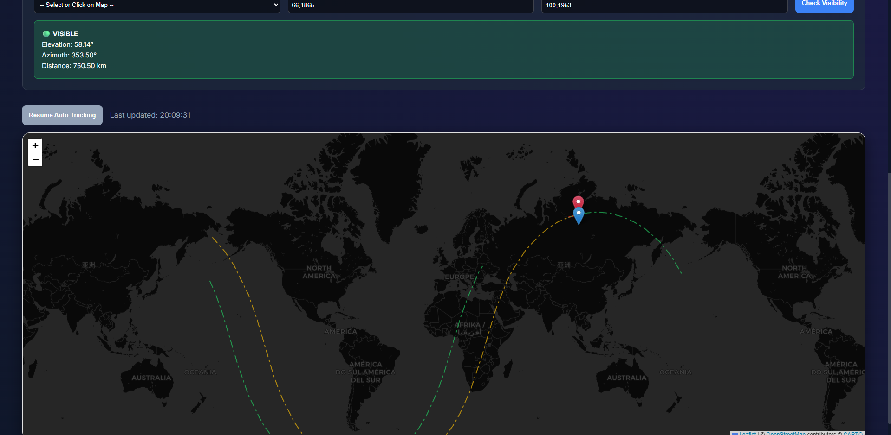
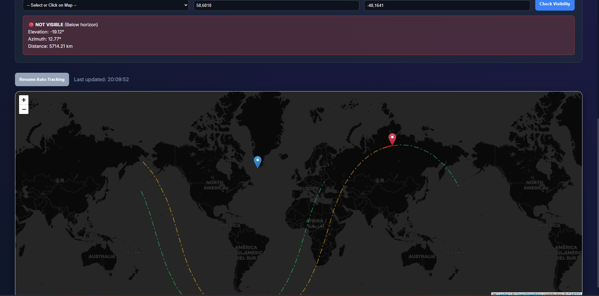

# 🛰️ Multi-Purpose Space Situational Awareness Platform

A web-based **Space Situational Awareness (SSA)** platform for satellite catalog analysis, real-time orbital tracking, ground-track visualization, observer-based visibility checks, and space-weather awareness.

The project started as a Streamlit prototype and was later redesigned as a client-server web application using **FastAPI** on the backend and **HTML/CSS/JavaScript** on the frontend. Real-time satellite positions are propagated from orbital-element data using **Skyfield / SGP4-compatible propagation**, while Three.js, Plotly.js, and Leaflet provide interactive visualization.

> **Project status:** Active prototype / v1.0  
> This project is intended as a technical and educational SSA prototype and is not an operational flight-safety or collision-avoidance system.

---

## ✨ Main Features

### 🌍 Global Situational Awareness

- Real-time satellite/object positions on an interactive **3D Earth globe**
- Real-time **2D world map**
- Live status indicator and automatic position refresh
- Up to **300 objects** displayed at once for visualization performance
- Server-side filtering by:
  - Orbit regime
  - Object type
  - Country/owner
  - NATO member states
  - Object name / NORAD catalog ID
- Color-coded objects for active payloads and other catalogued objects
- Orbit-density and country-distribution charts

### 🎯 Individual Satellite Tracking

The **Tactical Tracking Radar** view provides:

- Current latitude
- Current longitude
- Current altitude
- Live map position
- Automatic tracking with periodic updates
- Historical track from live position updates
- Predicted ground track
- Separate past and future ground-track display
- Anti-meridian handling to avoid map-rendering artifacts

The global and individual tracking views use propagated orbital positions rather than random or synthetic coordinates.

### 🔭 Observer Visibility Analysis

Visibility can be checked from:

- Manually entered latitude/longitude
- A location selected directly by clicking the map
- Predefined observer locations

Current predefined examples include:

- Buckley Space Force Base, USA
- Baku Tracking Station, Azerbaijan
- RAF Fylingdales, UK
- A sample ship position in the Atlantic Ocean
- Sydney Observatory, Australia

For the selected observer, the platform reports:

- **VISIBLE / NOT VISIBLE**
- Elevation
- Azimuth
- Slant distance

### ☀️ Space Weather

The platform integrates the latest **Planetary K-index (Kp)** from NOAA SWPC.

The dashboard classifies geomagnetic conditions as:

- Quiet
- Active
- Minor Storm
- Moderate Storm
- Strong Storm
- Severe Storm
- Extreme Storm

The result is cached for 15 minutes to reduce repeated external requests.

---

## 🏗️ Architecture

```text
                    ┌─────────────────────────┐
                    │       Frontend          │
                    │ HTML / CSS / JavaScript │
                    └────────────┬────────────┘
                                 │
                           REST / JSON
                                 │
                    ┌────────────▼────────────┐
                    │        FastAPI          │
                    │       Backend / API     │
                    └──────┬─────────┬────────┘
                           │         │
                 ┌─────────▼──┐   ┌──▼─────────────┐
                 │ Satellite  │   │ External Data  │
                 │ Catalogs   │   │ CelesTrak      │
                 │ GP/SATCAT  │   │ NOAA SWPC      │
                 └──────┬─────┘   └────────────────┘
                        │
                 ┌──────▼─────────┐
                 │ Skyfield /     │
                 │ orbital        │
                 │ propagation    │
                 └────────────────┘
```

### Backend

- **FastAPI** — REST API and application server
- **Skyfield** — satellite propagation and astronomical/orbital calculations
- **Pandas** — catalog loading, cleaning, merging, and filtering
- **NumPy** — numerical processing
- **Python threading** — background refresh of the global real-time position cache

### Frontend

- **HTML / CSS / Vanilla JavaScript**
- **Three.js** — interactive 3D Earth and instanced object rendering
- **Plotly.js** — statistical charts and 2D global map
- **Leaflet** — individual satellite tracking and observer-location map
- **Inter** font and custom dark/glass-style UI

---

## 📡 Data Sources

### CelesTrak

The application uses CelesTrak orbital/catalog data, including:

- General Perturbations / orbital-element data (`gp.csv`)
- Satellite Catalog data (`satcat.csv`)
- Live TLE retrieval for individual tracked objects

For individual tracking requests, the backend keeps a short-lived in-memory TLE cache to reduce repeated external requests.

### NOAA SWPC

The Space Weather module retrieves the latest **Planetary K-index** from the NOAA Space Weather Prediction Center.

---

## ⚙️ Real-Time Position System

The global globe is driven by actual propagated satellite positions.

At application startup:

1. Orbital data in `gp.csv` is parsed into `EarthSatellite` objects.
2. Objects are indexed by NORAD catalog ID.
3. The backend computes current positions using the Skyfield timescale.
4. Latitude, longitude, and altitude are derived from the propagated state.
5. A background thread refreshes the default global-position cache every **10 seconds**.
6. The frontend requests updated positions every **10 seconds** and re-renders the 3D and 2D views.

For filtered views, the backend applies the same filters server-side and computes the selected subset on demand.

The global visualization is intentionally limited to **300 displayed objects per refresh**. The full orbital catalog is retained for filtering and analysis, while the visualization uses sampling to keep browser rendering responsive.

---

## 🛰️ Individual Orbit Tracking

The individual tracking endpoint uses the following fallback strategy:

```text
Pre-parsed local orbital data
          ↓
Live CelesTrak TLE
          ↓
Local OMM data
```

When orbital data is available:

```text
Orbital data
    ↓
Skyfield propagation
    ↓
Geocentric state
    ↓
WGS84 subpoint
    ↓
Latitude / Longitude / Altitude
```

The ground-track endpoint calculates a configurable past/future window around the current time. The current frontend requests:

- **90 minutes into the past**
- **90 minutes into the future**

The frontend displays the two portions separately and re-segments tracks when the satellite crosses the ±180° longitude anti-meridian.

---

## 🔭 Observer Visibility

The observer module determines whether the selected satellite is above the observer's horizon.

The frontend allows the observer location to be selected in three ways:

```text
1. Enter latitude / longitude
2. Click directly on the map
3. Select a predefined location
```

The backend returns:

```text
Visibility
Elevation
Azimuth
Distance
```

The current implementation is a basic geometric horizon/line-of-sight check; it is not an optical observation-quality or atmospheric visibility model.

---

## 📊 Dashboard Analytics

### Global Metrics

- Total catalogued objects
- Active payload count
- Debris / rocket-body / inactive-object count

### Orbit Density

Objects grouped by:

- Orbit regime
- Object type

### Country Distribution

Top object-owning countries grouped by object type.

### Filtered Object Table

The table provides:

- Object name
- NORAD ID
- Object type
- Owner
- Orbit regime
- Track availability

Objects without usable orbital data are marked as not trackable.

---

## 🧭 Orbit Classification

The project currently uses heuristic orbit-regime classification based on orbital parameters.

Implemented categories include:

- HEO
- GEO
- GSO
- SSO
- Polar
- LEO
- MEO
- UNKNOWN

These are **project-specific heuristic classification rules**, not universal or authoritative orbital-regime definitions.

---

## 🔌 API Endpoints

| Endpoint | Method | Purpose |
|---|---|---|
| `/api/filters` | GET | Returns available orbit regimes, object types, and countries |
| `/api/data` | GET | Returns filtered catalog data, metrics, chart datasets, and table data |
| `/api/positions` | GET | Returns up to 300 real-time propagated object positions for the global views |
| `/api/live/{norad_id}` | GET | Returns the current live latitude, longitude, and elevation of one object |
| `/api/trackable/{norad_id}` | GET | Checks whether a catalogued object has usable orbital data |
| `/api/track/{norad_id}` | GET | Generates past/future ground-track coordinates |
| `/api/visibility/{norad_id}` | GET | Calculates observer-based visibility, elevation, azimuth, and distance |
| `/api/space-weather` | GET | Returns the latest NOAA Planetary K-index and geomagnetic severity |

---

## 📂 Project Structure

```text
web_ssa_tracker/
├── main.py
│   └── FastAPI application, real-time position cache,
│       satellite propagation, and API endpoints
│
├── functions/
│   └── utils.py
│       └── Data loading, catalog processing,
│           orbit and object classification
│
├── static/
│   ├── index.html
│   ├── tracking.html
│   ├── css/
│   │   └── styles.css
│   └── js/
│       ├── app.js
│       └── tracking.js
│
├── gp.csv
├── satcat.csv
└── requirements.txt
```

---

## 🚀 Installation

### Requirements

- Python 3.8+
- Internet access for external CelesTrak / NOAA data retrieval
- A modern web browser with WebGL support

### 1. Clone the repository

```bash
git clone https://github.com/YOUR_USERNAME/YOUR_REPOSITORY.git
cd YOUR_REPOSITORY
```

### 2. Install dependencies

```bash
pip install -r requirements.txt
```

### 3. Prepare the data files

Place the current:

```text
gp.csv
satcat.csv
```

in the project root.

### 4. Start the FastAPI server

```bash
uvicorn main:app --host 0.0.0.0 --port 8000
```

For development with automatic reload:

```bash
uvicorn main:app --host 0.0.0.0 --port 8000 --reload
```

### 5. Open the application

```text
http://localhost:8000
```

---

## 🧪 Current Scope

The platform currently focuses on:

- Resident space-object catalog visualization
- Real-time orbital position propagation
- Individual satellite tracking
- Ground-track visualization
- Observer visibility analysis
- Basic space-weather awareness
- Interactive SSA visualization and filtering

It does **not** currently implement:

- Full conjunction assessment
- Probability of collision calculation
- Covariance-based orbit determination
- Sensor fusion
- Autonomous collision avoidance
- Operational command/control functions

These are potential future research directions rather than current capabilities.

---

## 🔮 Potential Future Development

Possible future modules include:

- Satellite pass prediction
- Observation opportunity analysis
- Sensor field-of-view visualization
- Conjunction screening
- Space-debris environment analysis
- Maritime-domain-awareness support
- Critical infrastructure observation analysis
- Historical TLE/orbit trend analysis
- Ground-station coverage analysis
- Automated SSA reporting

---

## 📌 Project Status

This project is an independently developed SSA prototype and ongoing learning/research project.

The main areas explored are:

- Orbital mechanics
- Space Situational Awareness
- Satellite tracking
- Scientific programming
- Geospatial visualization
- Real-time data processing
- Decision-support-oriented software


---

## 📸 Screenshots

### Dashboard Page Top



### Dashboard 2D Map



### Dashboard 3D Globe



### Dashboard Filtered Data (No TLE)



### Dashboard Filtered Data (Trackable)



### Tactical Tracking Radar Page Top



### Tracking Check: Visible



### Tracking Check: Not Visible



